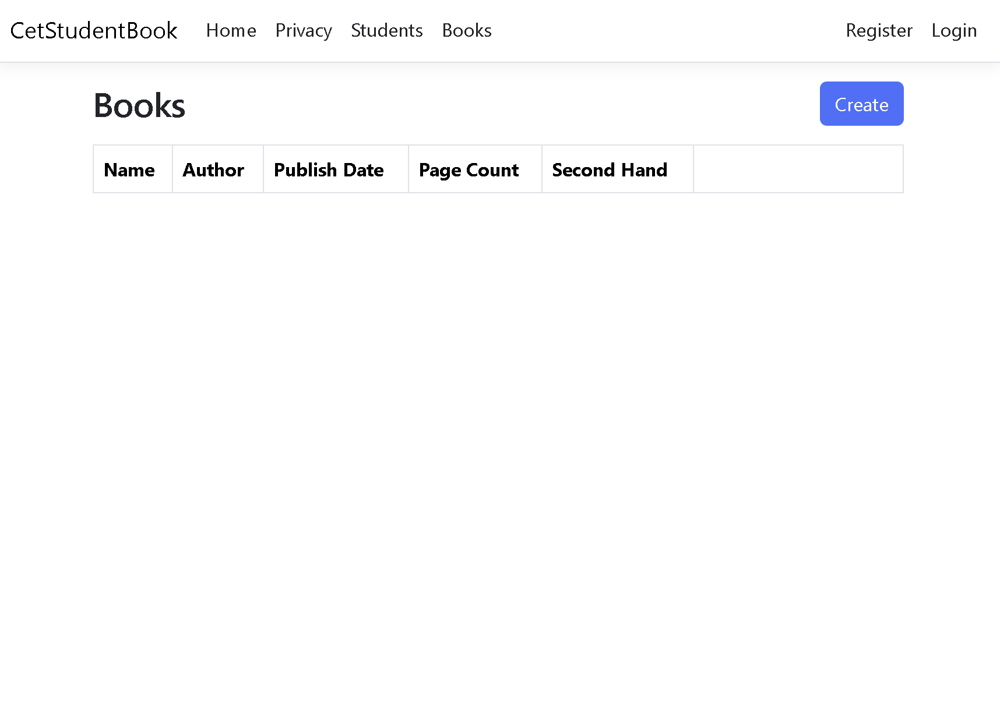
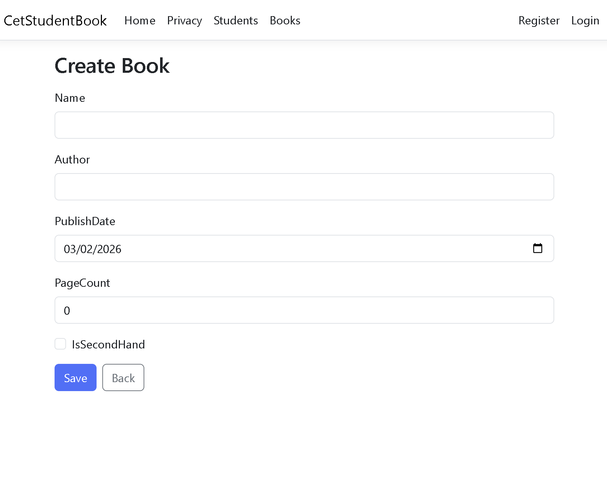
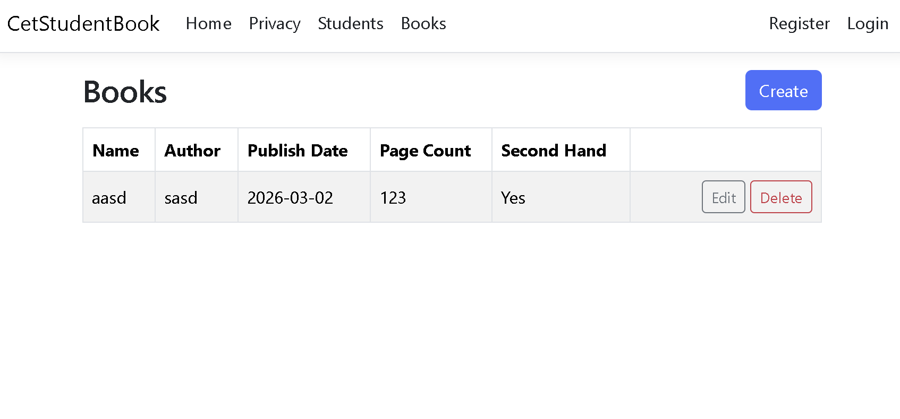
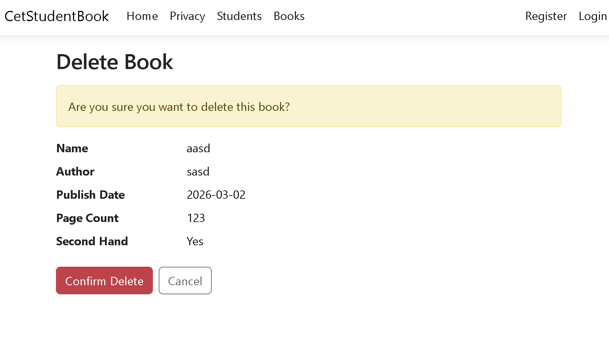
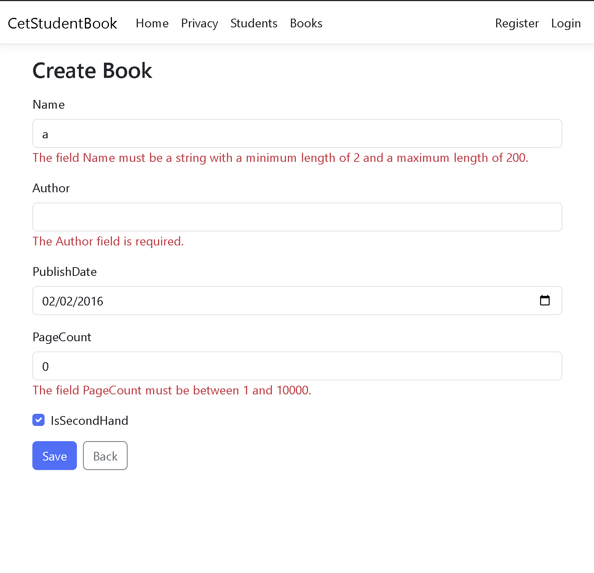

## Assignment: Books CRUD

I extended the base project by adding a new **Book** entity and implementing full CRUD pages manually (no scaffolding), using **ASP.NET MVC + Entity Framework Core (Code First)**.

Books pages (manual):
/Books (List)  
/Books/Create (Create)  
/Books/Edit/{id} (Edit/Update)  
/Books/Delete/{id} (Delete confirmation + delete)

How to run locally:
1) Open the solution in Visual Studio  
2) Run the project (F5)

Database / migrations:
Package Manager Console:
Update-Database

Screenshots:
Screenshots:

